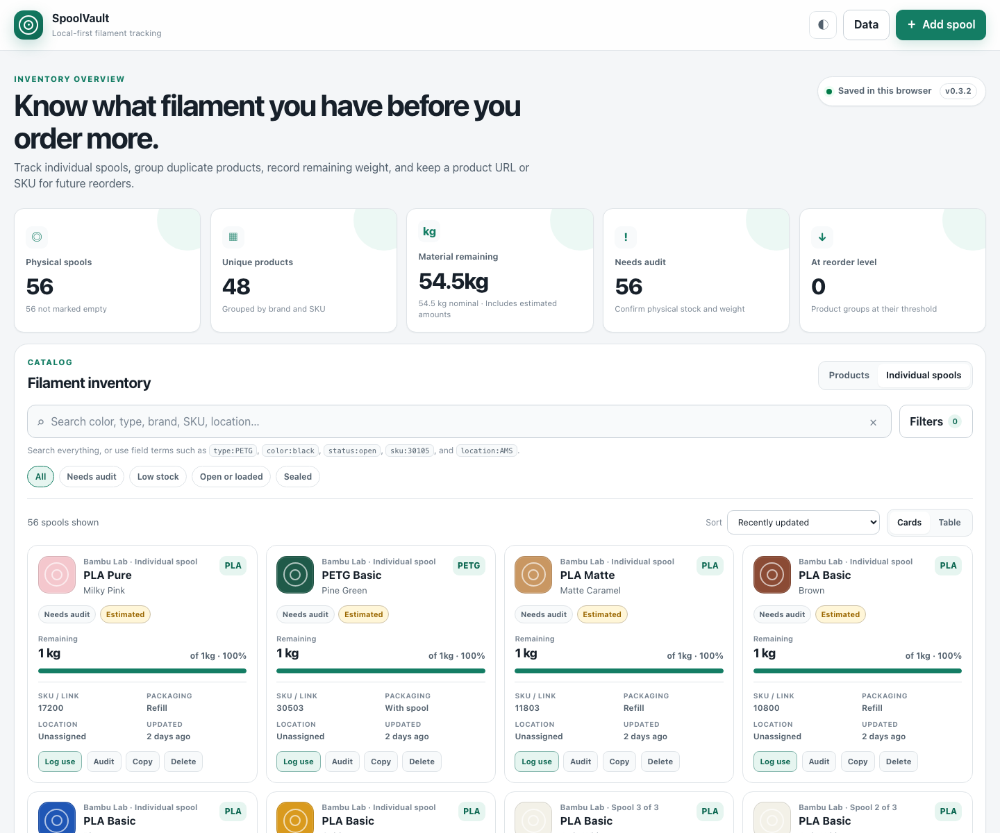
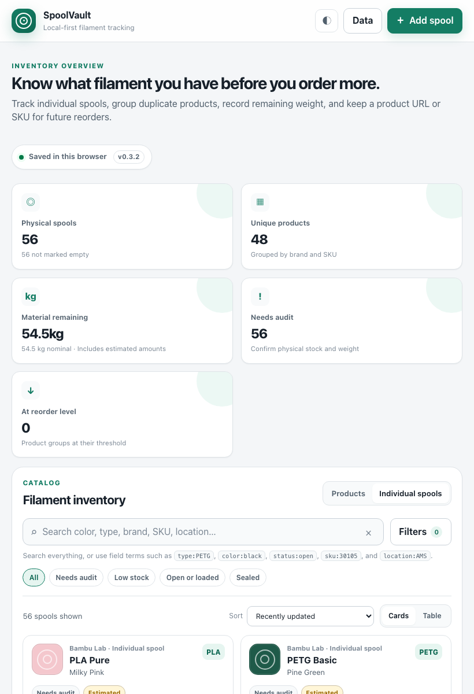

# SpoolVault

SpoolVault is a local-first filament inventory app for 3D printing. It helps you track the physical spools and refills you own, group duplicate products, record remaining material, and keep product references handy for reordering.

The app runs as a static website. It ships with a packaged inventory file, then saves your edits in the browser so you can keep using it without a backend.

## Screenshots





## What You Can Track

- Brand, material family, product line, color, SKU, and product URL
- Individual physical spools and refills
- Packaging type, nominal weight, remaining weight, and remaining percentage
- Status, storage location, reorder threshold, and audit state
- Duplicate products grouped by brand and SKU
- Inventory notes and recent activity

## How To Use It

Open the app and choose between two inventory levels:

- **Products** groups matching spools together so you can see how many of each product you own.
- **Individual spools** shows each physical spool or refill as its own record.

Use search for quick lookup across color, type, brand, SKU, location, status, notes, and URLs. Field searches are supported too:

```text
type:PETG
color:black
status:open
sku:30105
location:AMS
```

Use the quick filters for common checks like **Needs audit**, **Low stock**, **Open or loaded**, and **Sealed**. The full filter panel lets you narrow by brand, material, product line, color family, packaging, status, location, stock level, and product reference.

## Common Workflows

Add a new spool:

1. Select **Add spool**.
2. Fill in the product details, color, SKU, packaging, and nominal weight.
3. Add a product URL if you want a quick reorder reference.
4. Save the spool.

Audit your inventory:

1. Switch to **Individual spools**.
2. Select the **Needs audit** quick filter.
3. Find each physical spool or refill.
4. Edit its location, status, and remaining weight.
5. Mark it audited when the record matches what is on hand.

Record material usage:

1. Find the spool you used.
2. Select **Log use**.
3. Enter the amount used.
4. Save the change.

Back up your data:

1. Open the **Data** menu.
2. Choose **Export backup (.json)**.
3. Keep the file somewhere safe before clearing browser data or moving machines.

## Data Storage

SpoolVault reads its packaged starter inventory from:

```text
data/inventory.json
```

Your browser edits are saved locally under:

```text
spoolvault.local.v1
```

That means browser storage is the working copy. Clearing site data removes local edits unless you exported a JSON backup first.

If you update `data/inventory.json` and deploy the app again, visitors receive the new packaged inventory. Existing browser data can be refreshed from the **Data** menu with **Reload packaged inventory.json**.

## Run Locally

Install Node.js, then run:

```bash
npm run dev
```

Open:

```text
http://127.0.0.1:4173
```

Run tests with:

```bash
npm test
```

## Deploy

The app is static and deploys cleanly to Vercel. The included `vercel.json` serves the repository as static files, including `data/inventory.json`.

After pushing changes to GitHub, Vercel can build and publish the latest app automatically.
